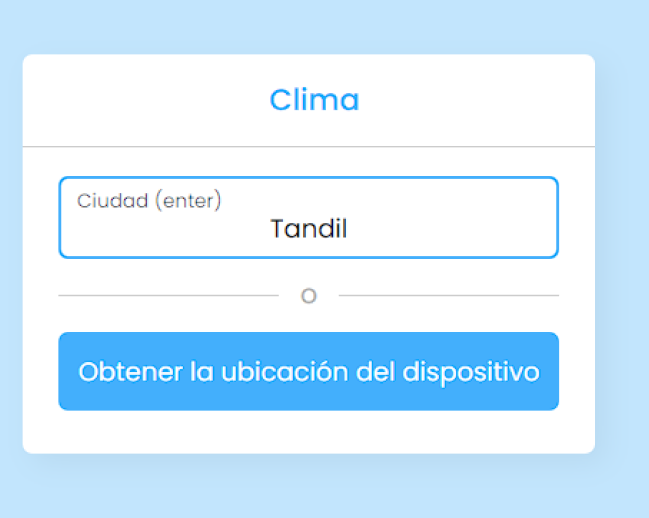
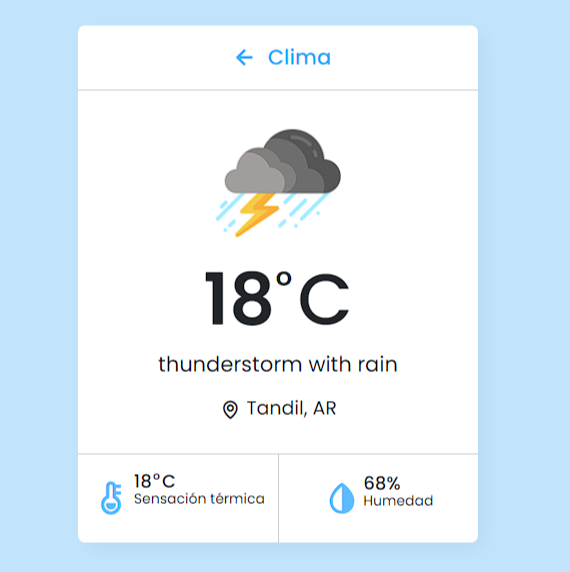

# Clima App

Esta app esta realizada mediante ``` HTML, CSS y JS ```.

Este ultimo es el que se encarga de obtener la informacion de la ciudad ingresada, y comunicarce via API con la pagina que nos brinda los datos.

Esta pagina es :
``` https://api.openweathermap.org ```

## Inicio 

<div align="center">
    
</div>

## Resultado

<div align="center">
    
</div>
